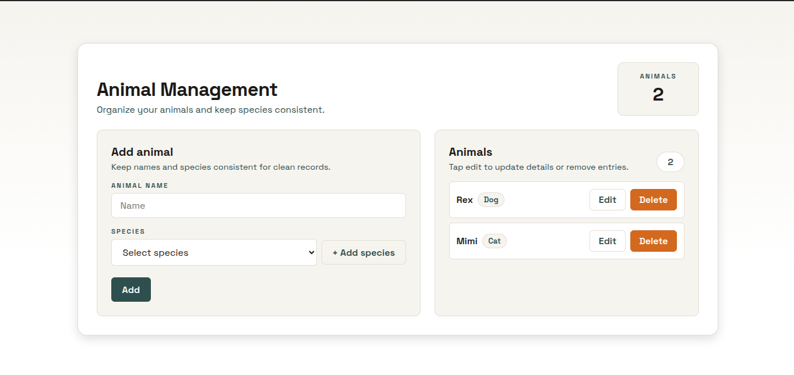

# Animals Manage

Manage animals and species with a clean UI built in React + TypeScript + Vite.

**Screenshot**


**Tests**
Commands:
- `yarn test`
- `yarn test:coverage`

Coverage (2026-02-20):
```text
-------------------------------|---------|----------|---------|---------|-------------------
File                           | % Stmts | % Branch | % Funcs | % Lines | Uncovered Line #s 
-------------------------------|---------|----------|---------|---------|-------------------
All files                      |   97.64 |    92.59 |   96.61 |   97.88 |                   
 src                           |     100 |      100 |     100 |     100 |                   
  App.tsx                      |     100 |      100 |     100 |     100 |                   
 src/components/animal-form    |     100 |      100 |     100 |     100 |                   
  index.tsx                    |     100 |      100 |     100 |     100 |                   
  styles.ts                    |     100 |      100 |     100 |     100 |                   
 src/components/animal-list    |     100 |      100 |     100 |     100 |                   
  index.tsx                    |     100 |      100 |     100 |     100 |                   
  styles.ts                    |     100 |      100 |     100 |     100 |                   
 src/components/animal-manager |   97.33 |    83.33 |   97.05 |   97.29 |                   
  index.tsx                    |   94.73 |    83.33 |   88.88 |   94.59 | 79-80             
  styles.ts                    |     100 |      100 |     100 |     100 |                   
 src/hooks/use-animal          |     100 |      100 |     100 |     100 |                   
  index.ts                     |     100 |      100 |     100 |     100 |                   
 src/hooks/use-species         |     100 |      100 |     100 |     100 |                   
  index.ts                     |     100 |     100  |     100 |     100 |                   
 src/store/animal              |     100 |      100 |     100 |     100 |                   
  index.ts                     |     100 |      100 |     100 |     100 |                   
  initial-state.ts             |     100 |      100 |     100 |     100 |                   
  store.ts                     |     100 |      100 |     100 |     100 |                   
 src/store/species             |      75 |       50 |      40 |   76.92 |                   
  index.ts                     |   66.66 |       50 |      40 |   66.66 | 8,13-14           
  initial-state.ts             |     100 |      100 |     100 |     100 |                   
  store.ts                     |     100 |      100 |     100 |     100 |                   
 src/styles                    |     100 |      100 |     100 |     100 |                   
  GlobalStyle.ts               |     100 |      100 |     100 |     100 |                   
  theme.ts                     |     100 |      100 |     100 |     100 |                   
 src/test                      |     100 |      100 |     100 |     100 |                   
  reset-stores.ts              |     100 |      100 |     100 |     100 |                   
  test-utils.tsx               |     100 |      100 |     100 |     100 |                   
-------------------------------|---------|----------|---------|---------|-------------------
```

**Commit Message Pattern**
This project uses Conventional Commits and validates messages with commitlint (via Husky).

Template:
```text
type(scope): short summary

[optional body]

[optional footer(s)]
```

Example (paste):
```text
feat(animal): add species selector
```

**Git Hooks (Husky + Commitlint)**
The hooks run automatically on commit:
- `pre-commit`: runs `yarn test`
- `commit-msg`: validates the message with commitlint

If hooks are not active yet:
```bash
yarn install
yarn prepare
```

**Project Structure**
```text
src
├── assets
│   └── react.svg
├── components
│   ├── animal-form
│   │   ├── index.tsx
│   │   ├── styles.ts
│   │   └── types.ts
│   ├── animal-list
│   │   ├── animal-list.test.tsx
│   │   ├── index.tsx
│   │   ├── styles.ts
│   │   └── types.ts
│   └── animal-manager
│       ├── animal-manager.test.tsx
│       ├── index.tsx
│       └── styles.ts
├── hooks
│   ├── use-animal
│   │   └── index.ts
│   └── use-species
│       └── index.ts
├── store
│   ├── animal
│   │   ├── index.ts
│   │   ├── initial-state.ts
│   │   ├── store.ts
│   │   └── types.ts
│   └── species
│       ├── index.ts
│       ├── initial-state.ts
│       ├── store.ts
│       └── types.ts
├── styles
│   ├── GlobalStyle.ts
│   ├── styled.d.ts
│   └── theme.ts
├── test
│   ├── jest.d.ts
│   ├── reset-stores.ts
│   ├── setupTests.ts
│   └── test-utils.tsx
├── App.test.tsx
├── App.tsx
├── main.tsx
└── vite-env.d.ts
```

**Libraries**
Dependencies:
- `@tanstack/react-store`
- `react`
- `react-dom`
- `styled-components`

Dev dependencies:
- `@commitlint/cli`
- `@commitlint/config-conventional`
- `@eslint/js`
- `@testing-library/dom`
- `@testing-library/jest-dom`
- `@testing-library/react`
- `@testing-library/user-event`
- `@types/jest`
- `@types/mocha`
- `@types/react`
- `@types/react-dom`
- `@vitejs/plugin-react`
- `eslint`
- `eslint-plugin-react-hooks`
- `eslint-plugin-react-refresh`
- `globals`
- `husky`
- `identity-obj-proxy`
- `jest`
- `jest-environment-jsdom`
- `ts-jest`
- `typescript`
- `typescript-eslint`
- `vite`
