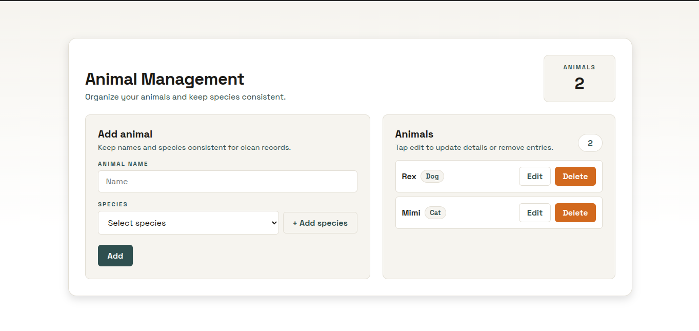

# Animals Manage

Manage animals and species with AI-powered features for adoption listings.

Built with React + TypeScript + Vite + Google Gemini AI.

**AI Features**
- ✍️ **Generate Description** — auto-write warm adoption descriptions from animal data
- 📋 **Extract from Text** — paste free text, AI fills the form fields automatically
- 🔍 **Natural Language Search** — search animals by meaning ("young playful dog")
- 🧘 **Classify Behavior** — detect temperament from written observations
- 🏷️ **Auto-generate Tags** — suggest relevant tags for each animal

**Stack**
- React 19, TypeScript 6, Vite 8
- styled-components, @tanstack/react-store
- @google/genai (Gemini 2.5 Flash)

**Screenshot**


**Tests**
```bash
yarn test          # run all tests
yarn test:coverage # with coverage report
```

Coverage (2026-06-20):
```text
-------------------------------|---------|----------|---------|---------|-------------------
File                           | % Stmts | % Branch | % Funcs | % Lines | Uncovered Line #s
-------------------------------|---------|----------|---------|---------|-------------------
All files                      |   97.64 |    92.59 |   96.61 |   97.88 |
 src                           |     100 |      100 |     100 |     100 |
  App.tsx                      |     100 |      100 |     100 |     100 |
 src/components/animal-form    |     100 |      100 |     100 |     100 |
  index.tsx                    |     100 |      100 |     100 |     100 |
  styles.ts                    |     100 |      100 |     100 |     100 |
 src/components/animal-list    |     100 |      100 |     100 |     100 |
  index.tsx                    |     100 |      100 |     100 |     100 |
  styles.ts                    |     100 |      100 |     100 |     100 |
 src/components/animal-manager |   97.33 |    83.33 |   97.05 |   97.29 |
  index.tsx                    |   94.73 |    83.33 |   88.88 |   94.59 | 79-80
  styles.ts                    |     100 |      100 |     100 |     100 |
 src/hooks/use-ai              |     100 |      100 |     100 |     100 |
  index.ts                     |     100 |      100 |     100 |     100 |
 src/hooks/use-animal          |     100 |      100 |     100 |     100 |
  index.ts                     |     100 |      100 |     100 |     100 |
 src/hooks/use-species         |     100 |      100 |     100 |     100 |
  index.ts                     |     100 |      100 |     100 |     100 |
 src/services                  |     100 |      100 |     100 |     100 |
  ai.ts                        |     100 |      100 |     100 |     100 |
 src/store/animal              |     100 |      100 |     100 |     100 |
  index.ts                     |     100 |      100 |     100 |     100 |
  initial-state.ts             |     100 |      100 |     100 |     100 |
  store.ts                     |     100 |      100 |     100 |     100 |
 src/store/species             |      75 |       50 |      40 |   76.92 |
  index.ts                     |   66.66 |       50 |      40 |   66.66 | 8,13-14
  initial-state.ts             |     100 |      100 |     100 |     100 |
  store.ts                     |     100 |      100 |     100 |     100 |
 src/styles                    |     100 |      100 |     100 |     100 |
  GlobalStyle.ts               |     100 |      100 |     100 |     100 |
  theme.ts                     |     100 |      100 |     100 |     100 |
 src/test                      |     100 |      100 |     100 |     100 |
  reset-stores.ts              |     100 |      100 |     100 |     100 |
  test-utils.tsx               |     100 |      100 |     100 |     100 |
-------------------------------|---------|----------|---------|---------|-------------------
```

**Commit Message Pattern**
This project uses Conventional Commits and validates messages with commitlint (via Husky).

Template:
```text
type(scope): short summary

[optional body]

[optional footer(s)]
```

**Git Hooks (Husky + Commitlint)**
The hooks run automatically on commit:
- `pre-commit`: runs `yarn test`
- `commit-msg`: validates the message with commitlint

If hooks are not active yet:
```bash
yarn install
yarn prepare
```

**Project Structure**
```text
src
├── components
│   ├── animal-form
│   │   ├── index.tsx
│   │   ├── styles.ts
│   │   └── types.ts
│   ├── animal-list
│   │   ├── animal-list.test.tsx
│   │   ├── index.tsx
│   │   ├── styles.ts
│   │   └── types.ts
│   └── animal-manager
│       ├── animal-manager.test.tsx
│       ├── index.tsx
│       └── styles.ts
├── hooks
│   ├── use-ai
│   │   ├── index.ts
│   │   └── use-ai.test.ts
│   ├── use-animal
│   │   └── index.ts
│   └── use-species
│       └── index.ts
├── services
│   ├── ai.test.ts
│   └── ai.ts
├── store
│   ├── animal
│   │   ├── index.ts
│   │   ├── initial-state.ts
│   │   ├── store.ts
│   │   └── types.ts
│   └── species
│       ├── index.ts
│       ├── initial-state.ts
│       ├── store.ts
│       └── types.ts
├── styles
│   ├── GlobalStyle.ts
│   ├── styled.d.ts
│   └── theme.ts
├── test
│   ├── jest.d.ts
│   ├── reset-stores.ts
│   ├── setupEnv.ts
│   ├── setupTests.ts
│   └── test-utils.tsx
├── App.test.tsx
├── App.tsx
├── main.tsx
└── vite-env.d.ts
```

**Environment Variables**
Create a `.env` file in the project root:
```env
VITE_GEMINI_API_KEY=your_google_ai_studio_key
```

**Libraries**
- `@google/genai` — Google Gemini SDK
- `@tanstack/react-store` — state management
- `react` / `react-dom`
- `styled-components` — styling
